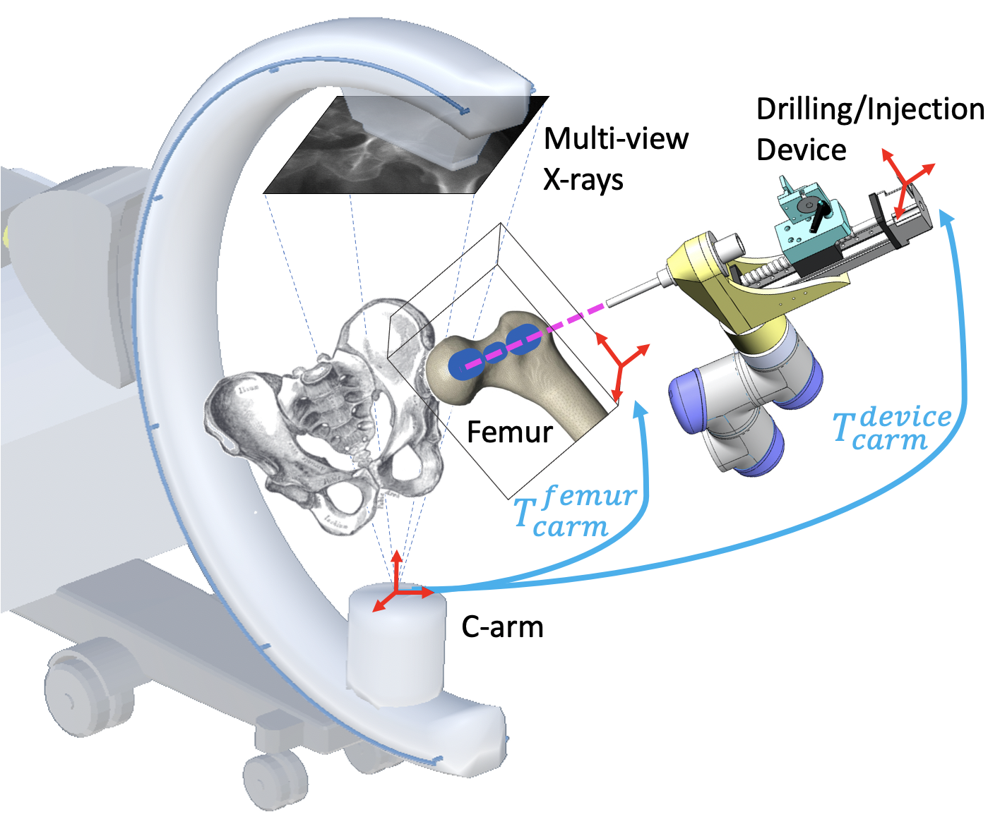
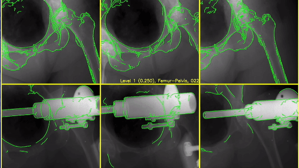

# 2D/3D Registration for Robot-Assisted Femoroplasty
 [TMRB Paper](https://ieeexplore.ieee.org/abstract/document/9151197) | [SPIE Paper](https://www.spiedigitallibrary.org/conference-proceedings-of-spie/11315/113151C/Fiducial-free-2D-3D-registration-of-the-proximal-femur-for/10.1117/12.2550992.full?webSyncID=46e9e6ec-7a49-dab6-a0cb-ad059329ad88&sessionGUID=3c9d902b-c999-3ced-268b-ead49a28531a&SSO=1) | [SPIE Talk](https://www.spiedigitallibrary.org/conference-proceedings-of-spie/11315/113151C/Fiducial-free-2D-3D-registration-of-the-proximal-femur-for/10.1117/12.2550992.full?webSyncID=46e9e6ec-7a49-dab6-a0cb-ad059329ad88&sessionGUID=3c9d902b-c999-3ced-268b-ead49a28531a&SSO=1)

C++ implementation of X-ray image based 2D/3D registration of femur and injection/drilling device for robot-assisted femoroplasty



***Fiducial-Free 2D/3D Registration for Robot-Assisted Femoroplasty***  
[Cong Gao](http://www.cs.jhu.edu/~gaoc/), Amirhossein Farvardin, Robert Grupp, Mahsan Bakhtiarinejad, Liuhong Ma, Mareike Thies, Mathias Unberath, Russell H. Taylor, and Mehran Armand   
*IEEE Transactions on Medical Robotics and Bionics*

In this paper, we propose a fiducial-free 2D/3D registration pipeline using fluoroscopic images for robot-assisted femoroplasty. Intra- operative fluoroscopic images are taken from multiple views to perform registration of the femur and drilling/injection device.



## Usage

### Prerequisites
This software is developed based on [xReg](https://github.com/rg2/xreg). Please refer to https://github.com/rg2/xreg for library installation and usage.

### Simulation Study
Under development ...

### Real X-ray registration
  * [2D/3D Registration of Pelvis and Femur using 3-view X-ray images](tmrb/xreg_regi_pelvis_femur)
  * More under development ...

## License and Citation
The software is available for use under the [MIT License](LICENSE).

If you use this code for your research, please cite our TMRB paper:
```
C. Gao et al., "Fiducial-Free 2D/3D Registration for Robot-Assisted Femoroplasty," in IEEE Transactions on Medical Robotics and Bionics, vol. 2, no. 3, pp. 437-446, Aug. 2020, doi: 10.1109/TMRB.2020.3012460.
----------------------------------------------------------------------
@ARTICLE{9151197,  author={C. {Gao} and A. {Farvardin} and R. B. {Grupp} and M. {Bakhtiarinejad} and L. {Ma} and M. {Thies} and M. {Unberath} and R. H. {Taylor} and M. {Armand}},  journal={IEEE Transactions on Medical Robotics and Bionics},   title={Fiducial-Free 2D/3D Registration for Robot-Assisted Femoroplasty},   year={2020},  volume={2},  number={3},  pages={437-446},  doi={10.1109/TMRB.2020.3012460}}
```
and SPIE2020 paper:
```
Cong Gao, Robert B. Grupp, Mathias Unberath, Russell H. Taylor, Mehran Armand, "Fiducial-free 2D/3D registration of the proximal femur for robot-assisted femoroplasty," Proc. SPIE 11315, Medical Imaging 2020: Image-Guided Procedures, Robotic Interventions, and Modeling, 113151C (16 March 2020); https://doi.org/10.1117/12.2550992
----------------------------------------------------------------------
@inproceedings{10.1117/12.2550992,
author = {Cong Gao and Robert B. Grupp and Mathias Unberath and Russell H. Taylor and Mehran Armand},
title = {{Fiducial-free 2D/3D registration of the proximal femur for robot-assisted femoroplasty}},
volume = {11315},
booktitle = {Medical Imaging 2020: Image-Guided Procedures, Robotic Interventions, and Modeling},
editor = {Baowei Fei and Cristian A. Linte},
organization = {International Society for Optics and Photonics},
publisher = {SPIE},
pages = {350 -- 355},
keywords = {2D/3D Registration, Femur Registration, X-ray Navigation, Femoroplasty},
year = {2020},
doi = {10.1117/12.2550992},
URL = {https://doi.org/10.1117/12.2550992}
}
```
